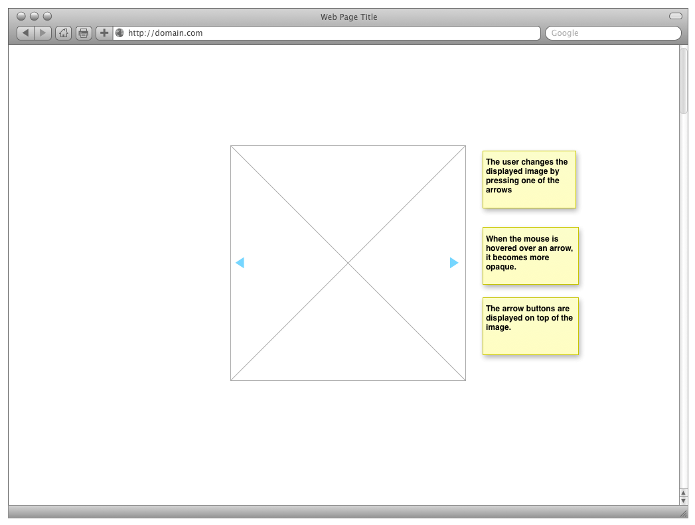
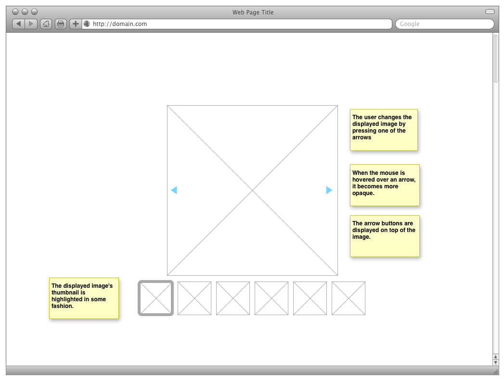

# Lab assignment 2 - JavaScript

**Before attempting to solve this assignment, make sure you have read the [general lab instructions](page.en.php?id=labs).**

## About the lab assignment

The second lab assignment in this course contains two tasks. The first is to complete certain exercises on Codecademy. The second task is to create a page with an interactive slideshow.

You will use JavaScript to manipulate existing HTML and to enable user interaction on a web page. You will also learn how to hunt bugs in your code using the web browser.

## Learning outcomes

After this lab assignment, you should have gained knowledge about the following:

* JavaScript syntax
* variables in JavaScript
* control structures in JavaScript
* loops in JavaScript
* how to define and call functions, both named and anonymous
* how to use web browser tools to debug your code
* how to manipulate HTMl and CSS using JavaScript
* how a JavaScript is loaded on a web page and where to place the `<script>` tag

## Submission and demonstration

1. Show your TA your Codecademy results page. The Codecademy exercises should be completed by each student in the group separately. 
2. Present the slideshow to your TA. Your TA will ask each member of the group a few questions about your work.
2. Zip the files needed to view your slideshow page and send the *single* zip-file to your TA.

## Tasks

1. **Codecademy exercises**: *Each group member* should register and complete the exercises listed below.
2. **Slideshow**: The group should then create a slideshow as specified below.

## Codecademy

* Each group member should register a user at [Codecademy](http://www.codecademy.com) (free).
* Each group member should do exercises 1, 3, 5, 6, 7, <ins datetime="2013-11-05T15:52:00+01:00">9</ins> <del datetime="2013-11-05T15:52:00+01:00">9.1</del> and 11 in the [JavaScript-track](http://www.codecademy.com/tracks/javascript). After completing the exercises, show your TA your result page. *Update 2013-11-05: All of exercise 9 should be completed.*

## Slideshow

### Preparations

Download the [lab template zip file](labtemplates/lab2-template.zip), unpack its contents. The zip file contains the following:

- an html file without thumbnail placeholders, but with a place for the main image + arrows
- a css file that places the main image and defines creates the CSS arrows
- images to use in the slideshow + thumbnails

### Slideshow - Basic difficulty

To complete the task at this level, you will need to modify the CSS file (style.css), and add JavaScript to the JavaScript file (script.js). You will also need to link to the JavaScript and run the JavaScript from the HTML file.

The following should be implemented to pass the basic difficulty level of this task.

- the arrow buttons should be semi-opaque when the interface is idle
- when the mouse hovers above a button (arrow), the arrow should become opaque.
- when the mouse hovers over a button (arrow), the mouse pointer should turn into a hand - hinting to the user that it is possible to click on it
- when the user clicks on the left arrow button, the previous image should be shown in the picture area
- when the user clicks on the right arrow button, the next image should be shown in the picture area
- the slideshow should loop
- write a short description on how the CSS triagles are created (the arrows).

### Slideshow - Advanced difficulty

To complete the advanced difficulty level, you will also need to modify the HTML file.

For the advanced difficulty level, you are required to, in addition to the requirements of the basic difficulty level, add a row of thumbnails to the slideshow where the current picture shown is highlighted in some way. You can use the thumbnail images [here](labtemplates/lab1/images).

It is recommended that you solve the task in two steps:

- Modify the HTML and CSS file from the basic difficulty level so that they create an interface such as in the wireframe below.
- Modify the JavaScript from the basic difficulty level so that it highlights thumbnail of the currently displayed image.

