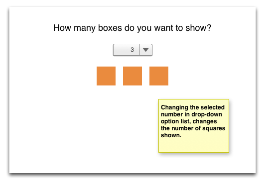
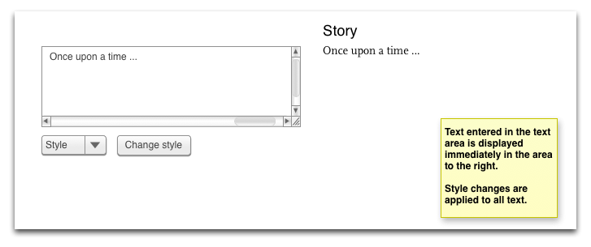
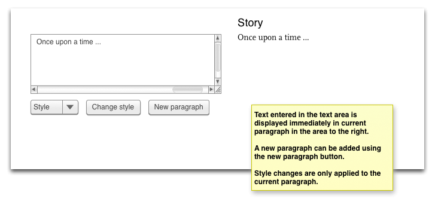
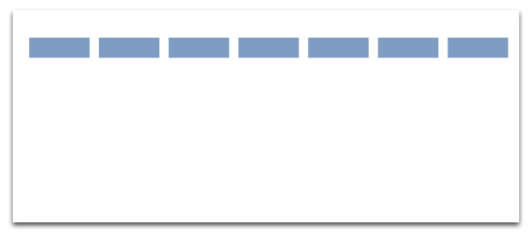
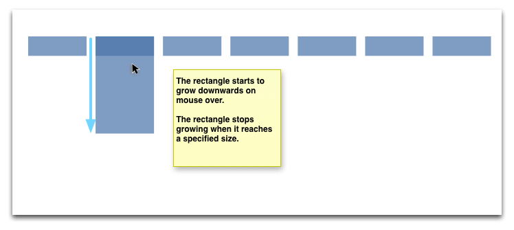
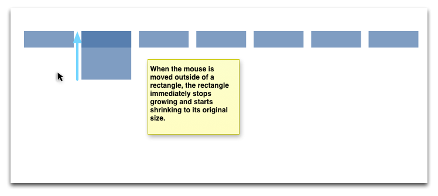
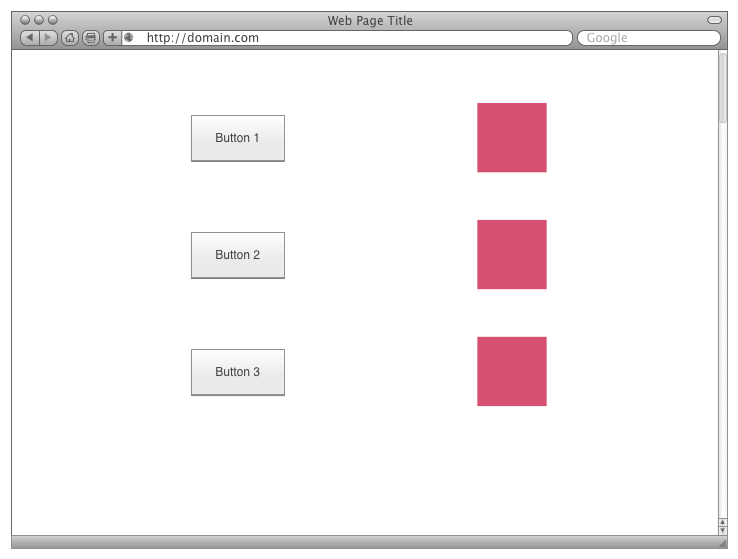
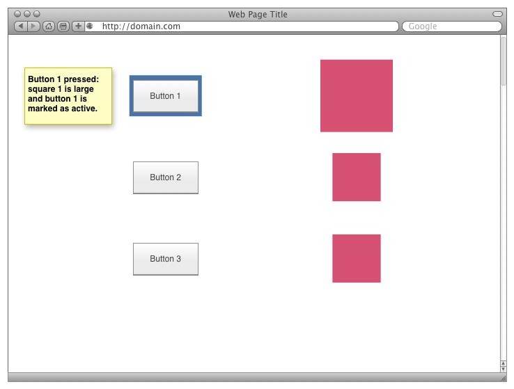
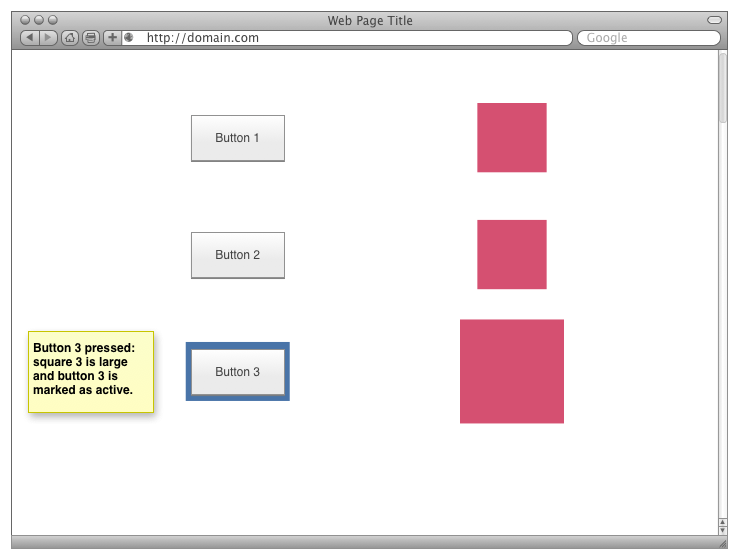
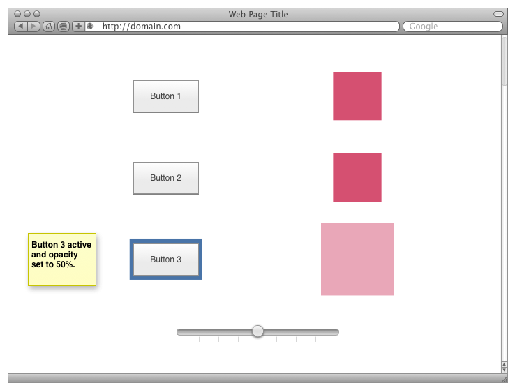

# Labb 3 - jQuery

**Before attempting to solve this assignment, make sure you have read the [general lab instructions](page.en.php?id=labs).**

## About the lab assignment

The third lab assignment in this course contains six separate exercises that will introduce you to interaction programming techniques using jQuery. 

## Learning outcomes

After this lab assignment, you should have gained knowledge about the following:

* How to use jQuery to select elements to manipulate
* How to use jQuery to edit an element's attribute values
* How to use jQuery to edit an element's CSS
* How to create new elements in the DOM using jQuery
* How to animate transitions using jQuery
* Implicit and explicit iteration in jQuery
* Using `$(document).ready`

## Submission and demonstration

1. Besides completing and submitting the exercises, you also have to submit a short report that contains the answers to the questions asked in each exercise. Please clearly mark which question you are answering in the report. The report should also contain the names and email addresses of all lab members.
2. When you have completed all the exercises, demonstrate each exercise to your TA.
3. Zip the exercise folder structure along with the report and send the zip archive to your TA.

## Exercises

*Common instructions for all exercises*: Make sure you comment your code so that your TA can understand your line of thought.

**[Download the lab template files here](labtemplates/lab3-template.zip). Unzip the archive and use the files provided.**

### Exercise 1 - First steps

In the first exercise, use the template files in the folder `ex1`. The template provides a blue square. For the first assignment, add jQuery code to `script.js` file. 

#### Basic & Advanced level

* make the square disappear when the mouse moves on top of it
* use the `$(document).ready()` function to wait until the document has loaded before adding your event handler
* Answer the following question: *What does the `$(document).ready()` function do? What information is possibly not available if you use `$(document).ready()`?*

Tip: Read <http://api.jquery.com/ready/> or <http://learn.jquery.com/using-jquery-core/document-ready/>

### Exercise 2 - using information from a option list element

The web page for exercise 2 is a page where the user uses a drop-down option form input to select the number of squares to be displayed in centered line. See image below.

#### Basic level

* Use the template in the folder `2a` and add your code to `script.js` to show and hide the correct number of boxes.
* Answer the following question: *What does `$(this)` mean in jQuery?*

*Tip*: To get the boxes to line, you may need to set the CSS display property.

#### Advanced level

Complete the basic level, then use the template in the folder `2b` and add your code to `script.js`

* Instead of showing and hiding the boxes. You should _create_ and _remove_ the correct number of boxes.

### Exercise 3 - Adding text with class

In exercise 3, you will use keyboard events to monitor a text area and make changes to text on the web page. The user should also be able to change the style of the text. See wireframes below.

Use the files in the folder `ex3`.

#### Basic difficulty level

* Text typed into the text area to the left is displayed in the paragraph to the right.
* The style of the paragraph to the right can be changed using the drop-down option menu and the "Change style" button.

#### Advanced difficulty level

In addition to the basic difficulty level, the following functionality should be added:

* A button is added to the interface. Pressing this button adds a new paragraph to the area to the right.
* This paragraph becomes the active paragraph.
* Only the active paragraph is affected by style changes.

### Exercise 4 - Manipulating CSS properties

The aim of the fourth exercise is to practice different kinds of CSS manipulation with jQuery.

Use the files in the folder `ex4`.

#### Basic & Advanced difficulty level

All the following should be completed.

* When the user clicks on a circle, the circle should change color. The color of the circle should toggle between two defined colors.
* When the user clicks on a square, the square should be resized to half its current size.
* When the user clicks on a rectangle, it should move down 10px.
* Answer the following questions:
	1. *How are the circles created?*
	2. *The page uses divs to lay out the shapes. Why are divs more flexible than using a table for layout purposes?*

### Exercise 5 - Start and stop animation

In exercise 5 you will learn how to cancel animation. Use the template files in the folder `ex5`, and implement the following:

#### Basic & advanced difficulty level

* When the mouse is over any single rectangle, it starts to grow downwards until it reaches a certain size.
* As soon as the mouse leaves any single rectangle, it stops growing and starts to shrink to its original size.

### Exercise 6 - Putting everything together

In this exercise you start with blank files. Implement a layout as shown in the wireframe below.

#### Basic difficulty level

Once you have created a HTML and CSS file that reproduces the layout above. Implement the following functionality:

* Each button should be connected to a box
* When the user clicks a button, two things happen:
    1. the corresponding box changes its size using an animated transition
    2. the button is marked visually as being activated, also using an animated transition
* when the user clicks another button, any previously activated button and box reverts to its original appearance, also using animated transitions

#### Advanced difficulty level

Implement all functionality of the basic difficulty level and add the following:

* Add a slider that is used to set the opacity of the square connected to the activated button.
* When a button is activated, the slider is set to the connected square's opacity level.

