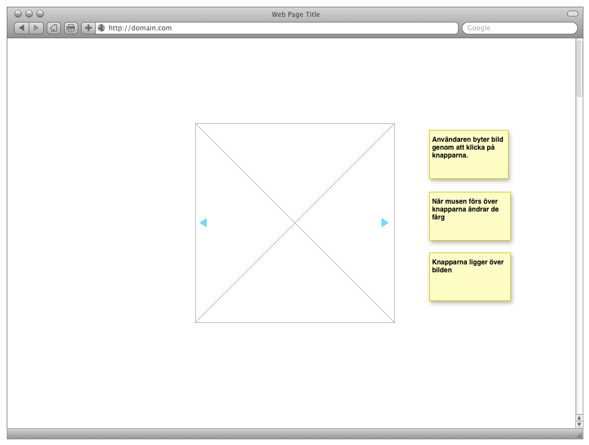
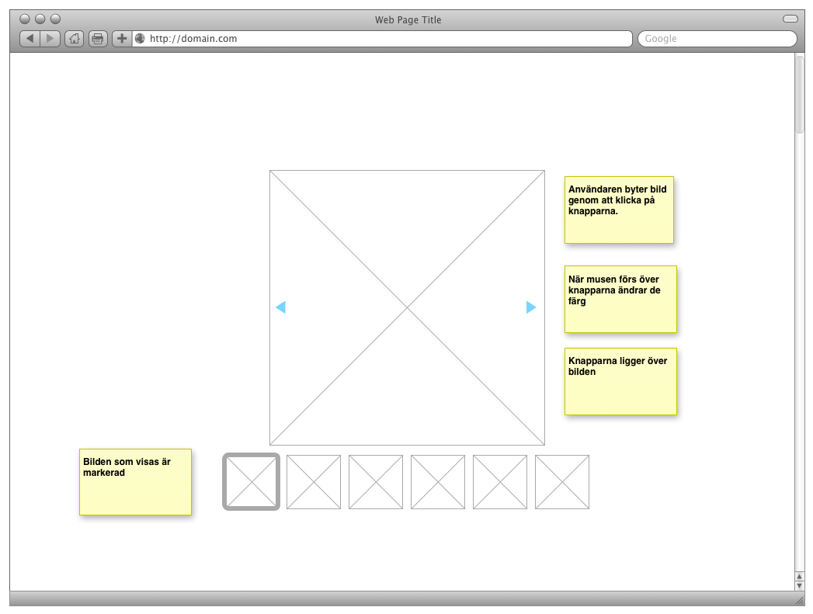

# Labb 2 - JavaScript

**Innan ni börjar med labben, se till att ni läst igenom de [allmänna labbinstruktionerna](page?id=labbar) som finns för kursen.**

## Om labben

I denna labb ska lära er grundläggande syntax i JavaScript och hur man använder JavaScript för att 

* manipulera existerande HTML
* möjligöra interaktion på en webbsida 

I processen kommer ni också lära er använda olika verktyg för att debugga och felsöka JavaScript som körs i en webbläsare.

## Kunskapsmål

* syntax som används i JavaScript
* variabelhantering
* kontrollstrukturer, loopar och villkorssatser 
* Skapa och kalla på funktioner, både namngivna och anonyma
* debugga med verktyg i webbläsare
* manipulera HTML och CSS med hjälp av Javascript
* förstå hur script laddas in när man öppnar en webbsida - placering av `<script>`

## Redovisning

1. Visa för er labbhandledare att ni gjort Codecademy-uppgifterna.
2. Skicka ett mail till er handledare. I titeln skriver ni "729G26 labb2" och bifoga sedan koden och bilder i mailet. Zippa ihop allt så att det bara är en fil ni skickar.

## Uppgift
Denna labb består av följande deluppgifter:

1. Registrera er på [Codeacademy](http://www.codecademy.com), gå till [JavaScript-kursen](http://www.codecademy.com/tracks/javascript) och gör uppgifterna   1, 3, 5, 7, 9, 11.
2. Gör en interaktivt fotoalbum. Se vidare instruktioner nedan.

### Codecademy

Vi kommer använda oss av material på [Codecademy](http://www.codecademy.com) under denna kurs. För att få tillgång till materialet och spara era resultat måste ni skapa ett konto där (gratis). När ni har skapat kontot gör ni **uppgift 1, 3, 5, 6, 7, 9 och 11** i deras [JavaScript-kurs](http://www.codecademy.com/tracks/javascript). Ni redovisar genom att visa för er handledare att ni gjort dem.

### Fotoalbum

För att komma igång behöver ni ladda ner filerna från _länk till filer_ och placera dem på lämplig plats i er hemkatalog. I katalogen hittar ni

- html-fil utan thumbnails
- css för placering av knappar
- bilder - stora och små

#### För G ska ni göra följande

- Göra det möjligt för användaren att bläddra i bildspelet som finns i statiskt format på sidan bildspel.html. 
- ändra färg på navigeringsknapparna när användaren håller musen över

### För G+ ska även göra följande

Som plusnivå så ska skapa en thumbnail som på samma sätt som visas i bilden nedan. Tanken är att översikten visar vilken bild som är vald genom att ha mindre transparens. För att genomföra denn uppgift så måste lägga till egen html och andvända bilderna som finns i mappen images/(small1.png, small2.png..). Ni kan dela upp det i två steg:

- Skapa HTML och CSS för att skapa en vy som i bilden nedan
- Använd javascript för att markera vilken bild som är vald i vyn med miniatyrbilder

* Skapa en thumbnail som i bilden nedan. 

