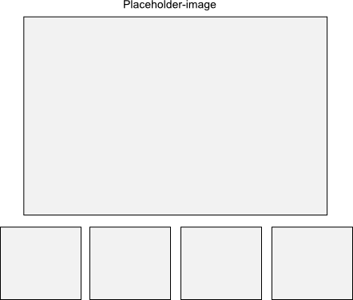

# Labb 2 - JavaScript

Innehåll 

* variabelhantering
* syntax
* kontrollstrukturer, loopar, villkorssatser
* anonyma funktioner
* punktnotation
* debugga med verktyg i webbläsare
* förstå hur script laddas in när man öppnar en webbsida - placering av `<script>`

## Resurser som tillhandahålls
* html-fil utan thumbnails
* css för placering av knappar
* bilder - stora och små

## Tips
* skapa array med ref till bilder
* console.log

## Uppgiftsbeskrivning

* göra ett bildspel interaktivt där användaren kan bläddra mellan ett antal bilder
* göra pilarna icke-transparenta när användaren håller musen över pilarna
* ändra färg på navigeringsknapparna när användaren håller musen över

### plusnivå
* generera html och css för att skapa en vy som i bilden nedan

* använd javascript för att markera vilken bild som är vald i vyn med miniatyrbilder
 

## Basnivå
* Codecademy: 1, 3, 5, 7, 9, 11
* Fotoalbumsuppgiften

## Plusnivå
* thumbnails under bilden som visas - aktuell bild markeras på något sätt

------Utkast till instruktioner nedan----------------------------------------------------------------
## Syfte 
Tanken med denna labben är att ni först ska lära er syntaxen för Javascript och sedan få applicera dessa kunskaper genom att lägga till interaktion på en hemsida. Syftet med det är att ni ska lära er hur Javascript kan användas för att manipulera HTML och CSS för att 

När ni genomfört labben är målet att ni ska kunna:

* variabelhantering
* kontrollstrukturer, loopar och villkorssatser 
* Skapa och kallar på funktioner
* debugga med verktyg i webbläsare
* manipulera HTML och CSS med hjälp av Javascript
* förstå hur script laddas in när man öppnar en webbsida - placering av `<script>`

##Förberedelser
För att komma igång behöver ni ladda ner filerna från _länk till filer_ och placera dem på lämplig plats i er hemkatalog. 

##Uppgift
Er uppgift är att med hjälp av Javascript göra sidan mer interaktiv genom att användaren kan bläddra genom ett antal bilder och att texten i för navigeringsknapparna ändrar färg när användaren håller musen över.

**Basnivå**

* Codeacademy
    - Uppgifterna: 1a, 3a, 5a, 7a, 9a, 11a
   
* Laboration
    - Göra det möjligt för användaren att bläddra i bildspelet som finns i statiskt format på sidan bildspel.html. 
    - Få texten för navigeringknapprna att ändra färg när man håller musen över.

**Plusnivå**
    
Som plusnivå så ska skapa en thumbnail som på samma sätt som visas i bilden nedan. Tanken är att översikten visar vilken bild som är vald genom att ha mindre transparens. För att genomföra denn uppgift så måste lägga till egen html och andvända bilderna som finns i mappen images/(small1.png, small2.png..)

* Skapa en thumbnail som i bilden nedan. 

##Redovisning
Redovisning av Codeacademy-uppgiftera
Skicka ett mail till er handledare. I titeln skriver ni "729G26 labb2" och bifoga sedan koden i mailet. 

